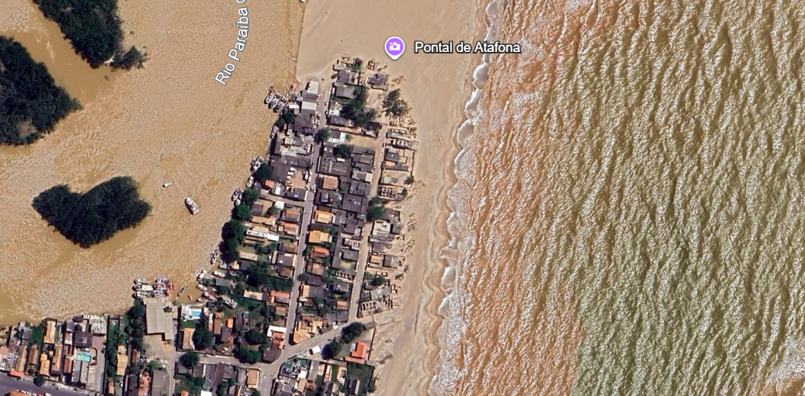

# Processamento de Imagens e Renderização em Nível de Detalhe (LoD)

**Tema Designado:** Regiões Litorâneas e Dinâmica Oceânica (Linha de Costa e Erosão)

---

## 1. Processamento e Tratamento de Imagem (Desafios de Computação Gráfica)

Ao renderizar superfícies marinhas e zonas costeiras, os algoritmos do Google Earth e TerraVision enfrentam desafios específicos no processamento visual de satélite:

1. **Reflexo Especular da Água (*Sun Glint*):**
   A incidência direta da iluminação solar sobre a superfície do oceano gera pontos de brilho excessivo que estouram o sensor da câmera. O algoritmo precisa aplicar filtros de correção de iluminação e balanço de brancos para evitar a perda de textura no mar.
2. **Desalinhamento Temporal (*Stitching* em Zonas Dinâmicas):**
   Como o oceano está em constante movimento, imagens capturadas em momentos ou dias diferentes apresentam marés e cristas de ondas desalinhadas. A junção (*stitching*) dessas fotos cria artefatos visuais ruidosos e "degraus" nas linhas de arrebentação das ondas.
3. **Baixo Contraste na Zona de Espraiamento:**
   A transição entre a areia molhada, a água rasa turbilhonada e a água profunda apresenta baixo contraste cromático. O sistema utiliza algoritmos de realce de bordas (como bandas de infravermelho próximo) para delimitar o vetor exato da linha de costa.

---

## 2. Design de Interface e Leis da Gestalt (UX/UI)

A interface de navegação espacial do sistema utiliza princípios de psicologia visual para guiar a atenção do usuário ao aproximar o zoom na zona de estudo:

* **Lei da Continuidade:**
  A linha de costa e as faixas de areia são percebidas pelo olho humano como rotas contínuas e fluidas. O design visual preserva o traçado ininterrupto da praia ao longo do zoom, permitindo ao analista acompanhar o transporte de sedimentos sem interrupções bruscas na interface.
* **Lei da Figura-Fundo:**
  O forte contraste entre o tom azul uniforme do oceano (fundo) e a faixa terrestre/urbana rica em detalhes (figura) permite que o usuário identifique instantaneamente áreas atingidas por erosão e estruturas de proteção (como quebra-mares) sem dispersar a atenção com os elementos do menu.

---

## 3. Imagens e Evidências

*Figura 1: Visualização em Alta Resolução (LoD < 1.000m) destacando a dinamica costeira, linha de praia e detalhes de erosão/estruturas litorâneas no Google Earth.*
